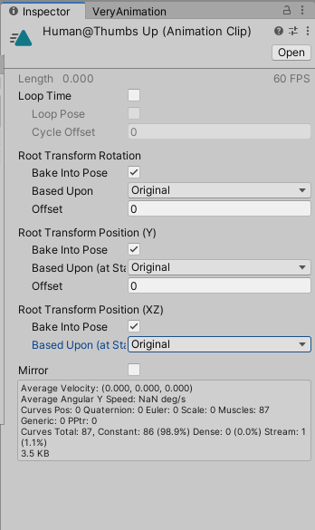
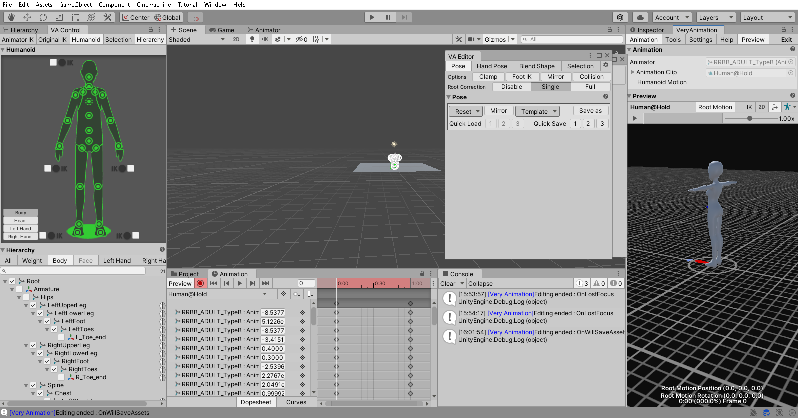
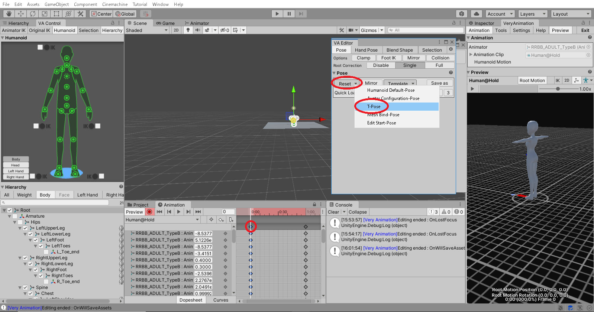
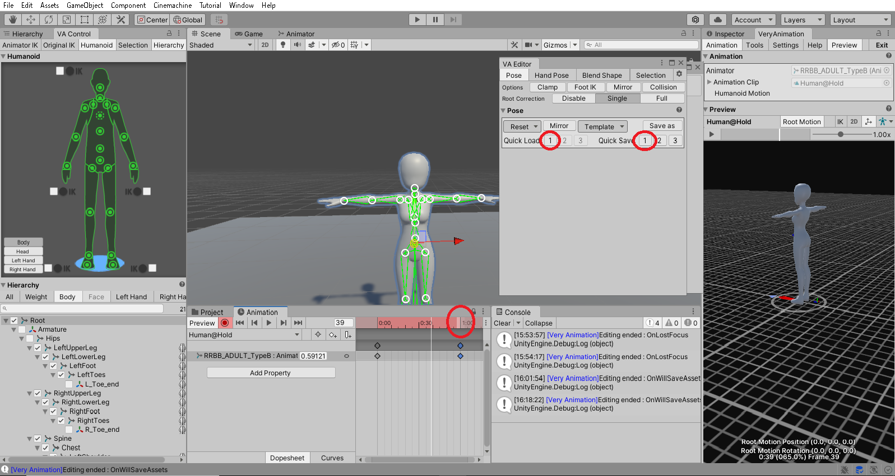

## アセットの使い方 - 3Dキャラクター - Very Animation

- [アセットの使い方へ](./../../)

### はじめに

Very Animationはアニメーションを制作・改変することができるアセット。

日本のパブリッシャーが開発しており、日本語のマニュアルがある。

### アニメーション編集を開始する際に

AnimationClipをInspectorウィンドウに表示し、Root Transform Rotation と Root Transform Position(Y) と Root Transform Position(XZ)の

- Bake Into Poseにチェックをつける
- Based Uponの選択を「Original」にする

Hierachy上の、AnimatorコンポーネントがアタッチされたGameObjectを選択し、Very Animationウィンドウから「Edit Animation」を選択。

最初のキーフレームを選択し、「VA Editor」→「Pose」→「Reset」→「T Pose」でフレームをTポーズにする。

最初のポーズをQuick Saveで保存し、終わりのフレームを選択して「Quick Load」でコピーする。

キーフレームを選択するにはダイヤのマークではなく、赤いタイムラインのところをクリックする必要がある。

### 目次

- [こういうアニメーションを作りたい](./patterns.md)

- [トラブルシューティング](./troubles.md)

### 仕組みについての備忘録

UnityにはIKという人間的なパラメータ（足の開き具合など）でボーンを制御する仕組みが導入されており、Very Animationはエディタ上からIKを参照してポーズを作っているようだ。

### 参考ページ

[マニュアル](http://alonesoft.sakura.ne.jp/VeryAnimation/manual.html)
: マニュアル。

[チュートリアル動画](https://www.youtube.com/channel/UCj64bv_Xr8g-Iki1v1mZ0QA)

[チュートリアル動画1](https://www.youtube.com/watch?v=rkCYVfA4yaU)
: 分かりやすい。