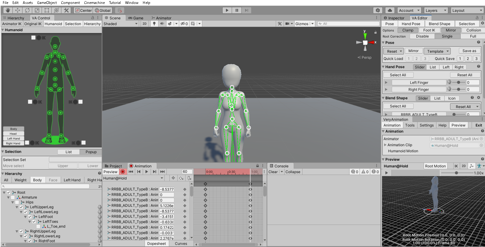
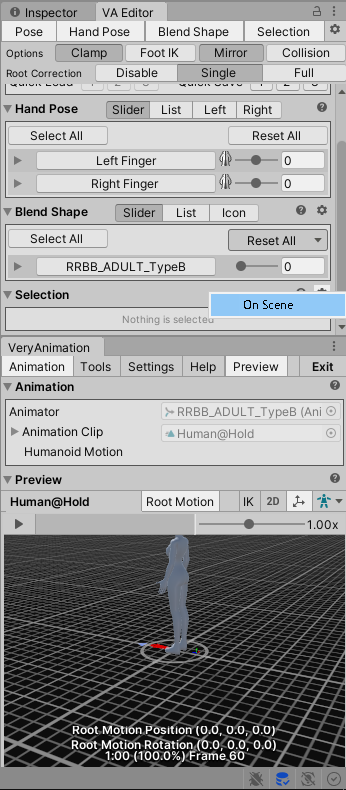
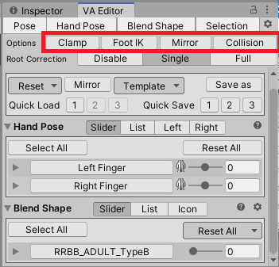

## アセットの使い方 - 3Dキャラクター - Very Animation

- [アセットの使い方へ](./../../)

### はじめに

Very Animationはアニメーションを制作・改変することができるアセット。

日本のパブリッシャーが開発しており、日本語のマニュアルがある。

### アニメーション編集を開始する際に

AnimationClipをInspectorウィンドウに表示し、Root Transform Rotation と Root Transform Position(Y) と Root Transform Position(XZ)の

- Bake Into Poseにチェックをつける
- Based Uponの選択を「Original」にする

Hierachy上の、AnimatorコンポーネントがアタッチされたGameObjectを選択し、Very Animationウィンドウから「Edit Animation」を選択。

最初のキーフレームを選択し、「VA Editor」→「Pose」→「Reset」→「T Pose」でフレームをTポーズにする。

最初のポーズをQuick Saveで保存し、終わりのフレームを選択して「Quick Load」でコピーする。

キーフレームを選択するにはダイヤのマークではなく、赤いタイムラインのところをクリックする必要がある。

アニメーション編集時の画面の基本レイアウトは下の画像の通り。VA Toolsは表示しなくてよい。

選択箇所を表すウィンドウは「Selection」→「On Scene」にチェックをつけるとシーンビューに表示できる。

この状態で関節をクリックすると、Selectionウィンドウに人間の骨格に合わせた各方向の回転のメッセージが表示され、可動域（通常-1～1）に合わせてパラメータ設定できる。

Editorの「Options」は、ポージングの上で便利な項目。

- Clamp : 可動域を-1～1の範囲外に設定できるようになる。
- Foot IK : 足の動き方を自然にする。
- Mirror : 編集を左右対称に行う。
- Collision : メッシュ同士が接触しないようにする。処理が重い。

足のIK入れてRootを動かすといい感じに足が曲がると思いきや……膝関節が逆になるんですが……。実際のメッシュに対してボーンが直線になっていることが原因っぽい。モデル側のボーン調整が必要か。

### 目次

- [こういうアニメーションを作りたい](./patterns.md)

- [トラブルシューティング](./troubles.md)

### 仕組みについての備忘録

UnityにはIKという人間的なパラメータ（足の開き具合など）でボーンを制御する仕組みが導入されており、Very Animationはエディタ上からIKを参照してポーズを作っているようだ。

### 参考ページ

[マニュアル](http://alonesoft.sakura.ne.jp/VeryAnimation/manual.html)
: マニュアル。

[チュートリアル動画](https://www.youtube.com/channel/UCj64bv_Xr8g-Iki1v1mZ0QA)

[チュートリアル動画1](https://www.youtube.com/watch?v=rkCYVfA4yaU)
: 分かりやすい。