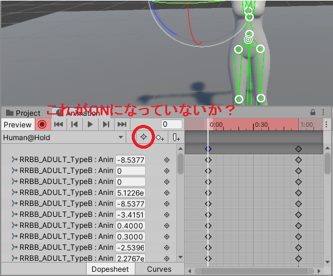

## アセットの使い方 - 3Dキャラクター - Very Animation - トラブルシューティング

- [Very Animationのトップへ](./index.md)

### 存在しないキーフレームがあるかのようなアニメーション

「Animation」タブの「Filter by selection」をOFFにすると全ボーンが表示される。選択していないボーンにキーフレームが設定されている場合がある。

### 参考ページ

