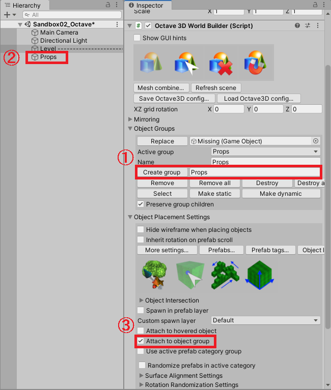

## アセットの使い方 - 3Dモデル(ツール) - Octave3D-Level Design

-[アセットの使い方へ](./../)

### 概要

\$82.5で販売。（2021/11時点）

学習コストはかなり高いらしいが、強力なレベルデザインツール。

### 導入

Levelなどの名前で親となるGameObjectをCreate Emptyする。

それに対し、「Scripts」→「O3DWB」→「Octave 3D World Builder」をAdd Component。

すると、Worldにグリッドのようなものが描画され、Inspectorから様々なメニューを選べるようになる。

メインメニューには

- オブジェクト配置（Aキー）
- オブジェクト選択（Sキー）
- オブジェクト消去（Dキー）
- オブジェクトスナップツールの設定

がある（現バージョン。バージョンごとにUIのレイアウトなどは異なる）。

### 使用

#### プレハブの登録

オブジェクト配置メニューから「Object Placement Settings」→「Prefabs..」ボタンをクリックすると「Prefab Manage」ウィンドウが開く。

使用したいプレハブを入れる。フォルダごとにD\&Dも可能。その場合、フォルダ名が自動でカテゴリ名になる（後で変えられる）。

登録したプレハブはプレビュー表示される。

プレハブのプレビュー表示中も、新たにProjectビューからプレハブをD\&Dすると登録可能。

#### プレハブの配置

Prefab Manageウィンドウでプレハブを選択した上でシーンビュー上にカーソルを置くと、グリッドの高さでプレハブを配置するような配置プレビューが出る。

この状態では、プレハブの中心および四方にpivotの表示が出て、黄色い（ハイライトされている）pivotがグリッド（または、オブジェクトへのスナップモードの場合はオブジェクト）にスナップするようにオブジェクトが配置される。

既にオブジェクトが置いてある場所に対しては、上に重なるように配置される。

配置中にショートカットキーを使える。

Yキー
: Y軸方向にオブジェクトを90°回転。（壁の向きを変える時などに使う）
: Cキーでも似た動作をするが、厳密にはCキーは床の法線の軸に対して回転する。

Jキー
: ハイライトするpivotを順番に切り替える。

Ctrl \+ Shift \+ マウス横移動
: 配置するオブジェクトを拡大縮小。

Oキー
: 拡大縮小を元のスケールに戻す。

Shift \+ Yキー \+ マウス横移動
: Y軸方向に配置するオブジェクトを任意の角度回転。（ランダムな感じで配置したい時に使う）

Iキー
: 回転を元の角度に戻す。

Nキー
: 押下時、オブジェクトの上端を基準に配置する。
: (通常はオブジェクトの下端を基準に配置する。階段や、厚みのある床に使用する)

Uキー
: 「グリッドにスナップする」\/「オブジェクトにスナップする」を切り替える。
: シーンビュー左上の「Objet to object snap \[U\]」がTrueならオブジェクトにスナップ。

Wキー
: シーンビュー左上の「Enable object surface grid \[W\]」を切り替える。
: これがTrueの時、設置済みのオブジェクトの表面にもグリッドが表示され、そこにスナップできるようになる。

#### オブジェクト配置される親のGameObjectを設定（ObjectGroup）

通常、HierachyはWorld BuilderがアタッチされているGameObjectなどに配置したい。

しかし、初期状態だとHierachyのシーン直下に配置されてしまう。任意のGameObject下に配置してグルーピングできるよう、ObjectGroupという仕組みがある。

作成したいグループ名を選んで「Create Group」(1)を実行すると、新たにGameObjectが作成される(2)。

Object Placement Settingsで「Attach to Object Group」にチェックを入れる(3)と、ルートでなくそのGameObject下に配置されるようになる。

- (2)で作成したGameObjectはHierachy上の好きな位置に移動できる。
- (2)で作成したGameObjectはおそらく内部的に参照が保持されている。
  - GameObjectの名前を変えたい場合、ObjectGroupsの「Name」を変更する。（Hierachy上で変更しても勝手に戻る）
  - 同名のGameObjectをHierachy上に作成しても、ちゃんと最初に作成されたGameObject下に配置される。

#### 設置済みオブジェクトの操作

WorldBuilderがアタッチされたGameObjectを選択した状態で、シーンビューでPrefabをタッチするとそれを編集できるようになる。

Wキー
: 選択中のオブジェクトを移動させるギズモを出す。

Eキー
: 選択中のオブジェクトを回転させるギズモを出す。

Rキー
: 選択中のオブジェクトのスケールを変更するギズモを出す。

X, Y, Zキー
: その軸に90°回転。

Deleteキー
: 消す。

Ctrl\+Dキー
: 複製し、複製したものを選択した状態にする。
: ただし、Attach to object groupにチェックを入れていないとObjectGroup外に複製されてしまう。

#### 既存のシーンのオブジェクトをOctave3D風に編集できるようにする

既存のオブジェクト（例えばLevelのルートオブジェクト）にWorldBuilderをアタッチした後、
プレハブ群が入っているGameObject上で右クリック→Octave 3D→make groupする。

![make group]](./media/octave3d_make_group.png)

すると、それが上記のCreate Groupで作るのと同様のObjectGroupとなる。

後は上記の「設置済みオブジェクトの操作」を参照のこと。

#### 屋内の作り方

#####  設置のベース高さを変える・スナップグリッドの大きさを変える

天井から吊り下げたい場合など、設置のベース高さを変えたい場合がある。

6キー
: グリッドの高さを1m上げる。

5キー
: グリッドの高さを1m下げる。

この「1m」というのは設定で変更することができ、Octave3DでなくUnityの機能として設定されている値である。

「Edit」→「Snap and Grid Settings」で変更できる。

ゲーム全体の設定が変わってしまうので、床面の高さを手動で調整した後で後述のDecor Paintを行う方が良いかも。

現在、良さそうな方法を模索中。

#### Terrain上への設置

「Decor Paint」を選択すると、自動でTerrainに沿って設置してくれる。

