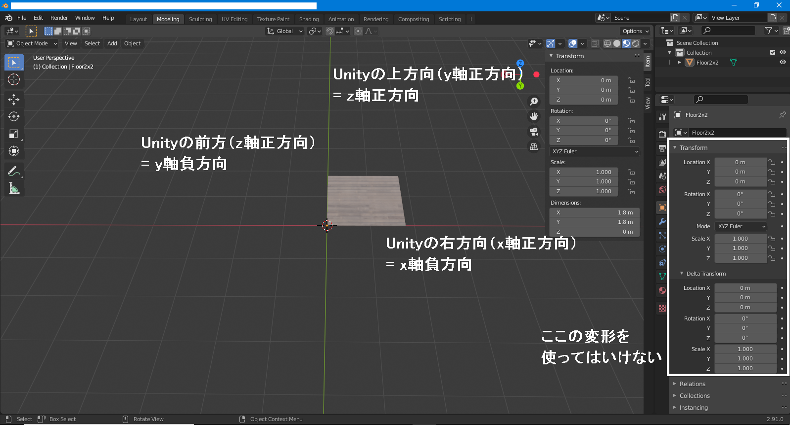
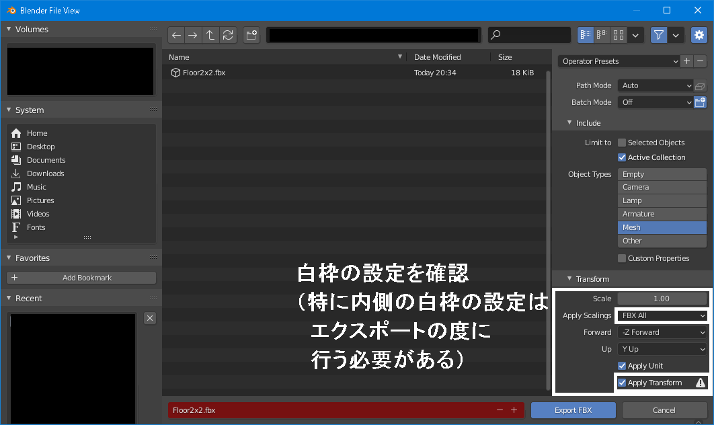

## Tips - Blender - Unityへの使用を想定してfbxで書き出す

-[Tipsへ](./../../)

### BlenderとUnityの軸の違い

- Unityの前方(Z軸正方向)は、BlenderのY軸負方向
- Unityの右方向（X軸正方向）は、BlenderのX軸負方向
- Unityの上方向（Y軸正方向）は、BlenderのZ軸正方向

Blenderでモデリングする際は、Y軸の負方向を奥側に向けるとUnityの座標軸のイメージでモデリングすることができる。

### エクスポート設定

上記の軸の議論からすると、Forwardが-Z、UpがYというのは、Forwardの向きがおかしいのではという気もするが、おそらく左手座標系と右手座標系の関係で、これでよい。