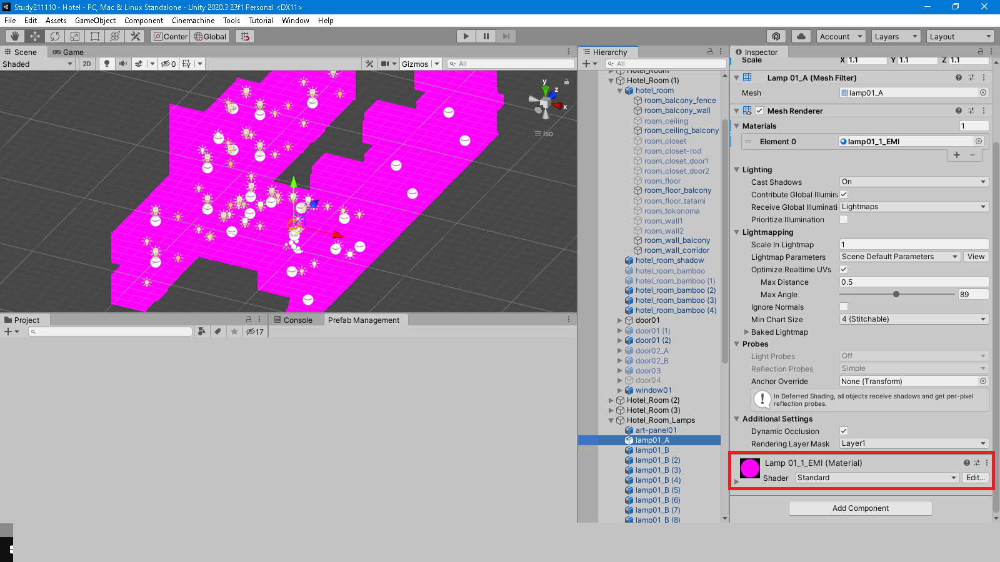
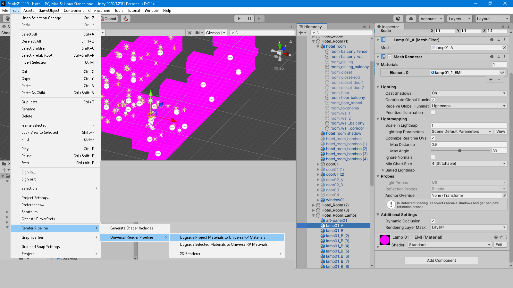

## シェーダのコンパイルエラー

-[目次へ](./)

### 全部ピンクになる

HDRP専用など、URP非対応のアセットはURPだと全部ピンクになる。

ピンク色のオブジェクトを選択して、マテリアルに割り当てられているShaderが「Standard」（あるいはHDRPにおいて標準的なシェーダ）であれば、一括して変換できる。

「Edit」→「Render Pipeline」→「Universal Rendering Pipeline」→「Upgrade Project Materials To UniversalRP Materials」

### Couldn't open include file 'Packages/com.unity.render-pipelines.lightweight/ShaderLibrary/Core.hlsl'

(2020.3.23f1にて)

Fantastic Village Packのデモシーン内で発生。

lightweightをuniversalに変えればいいのかと思いきや、別のエラーが出た。このシェーダ（S_Water_LWRP.shader）はそもそもLWRP用であり、URP用ではなかったので、プロジェクトでLWRPを使用するという設定を行っていないためファイルがなくエラーが出た。

シーンに「URPで実行する場合は水のシェーダをS_water_URP.shaderに変更すること」と注意書きがあり、それに従ったら直った。LWRPはURPの旧名称とのこと。

### failed to open source file: 'LWRP/ShaderLibrary/Core.hlsl'

上のトラブルを調べていて見つけた情報で、上よりもう少し古いUnityで発生する。

[このページ](https://baba-s.hatenablog.com/entry/2019/04/21/230500)を参照。

Unityのバージョンアップでこの「Core.hlsl」の場所が変わった。

